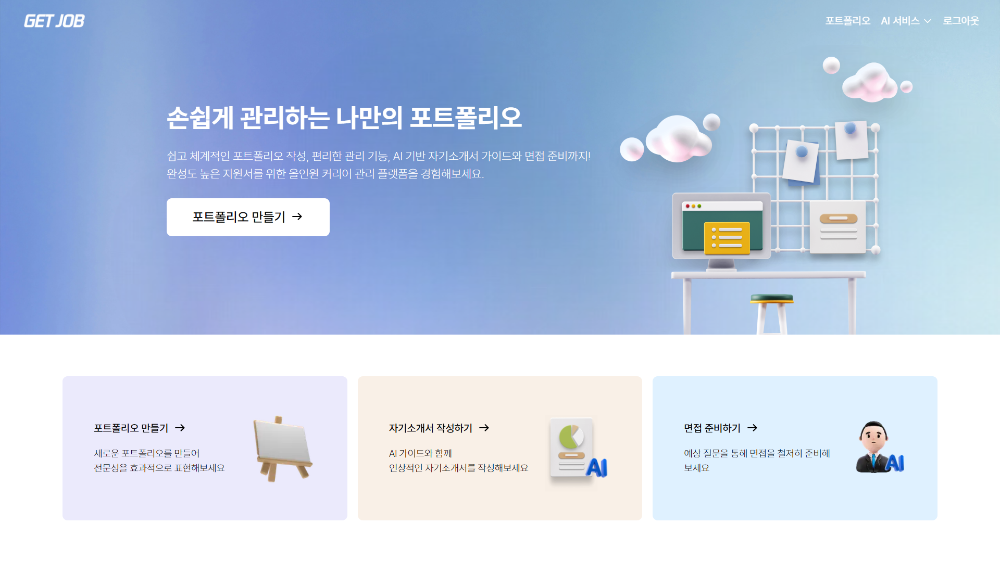
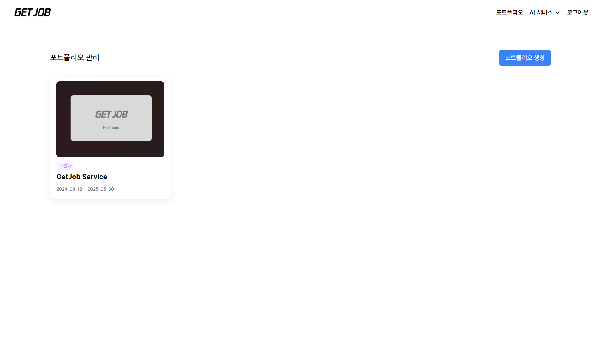
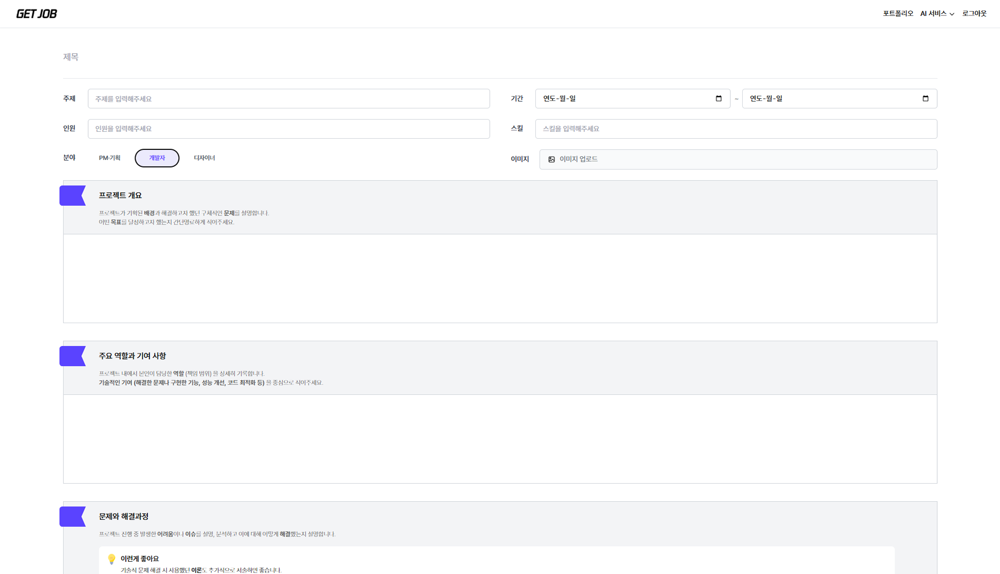
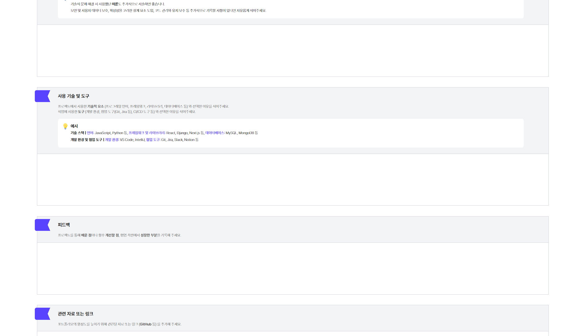
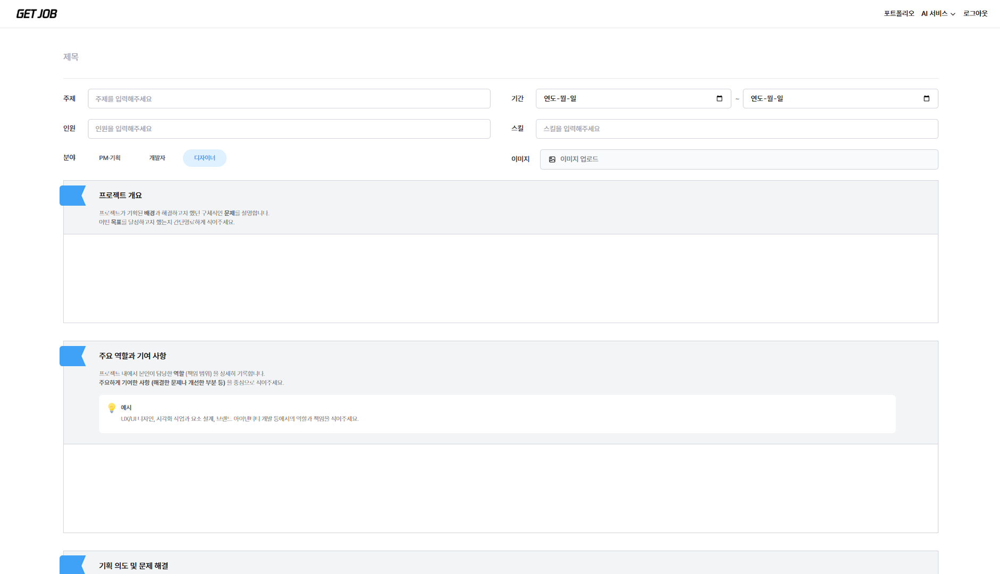
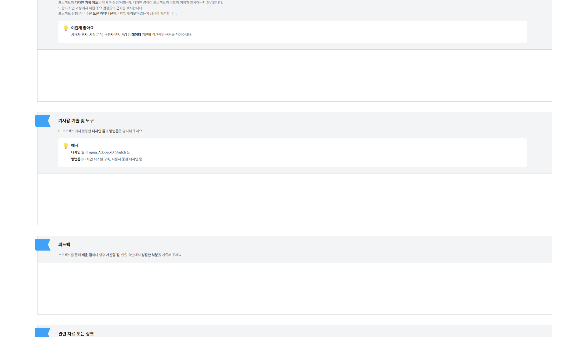
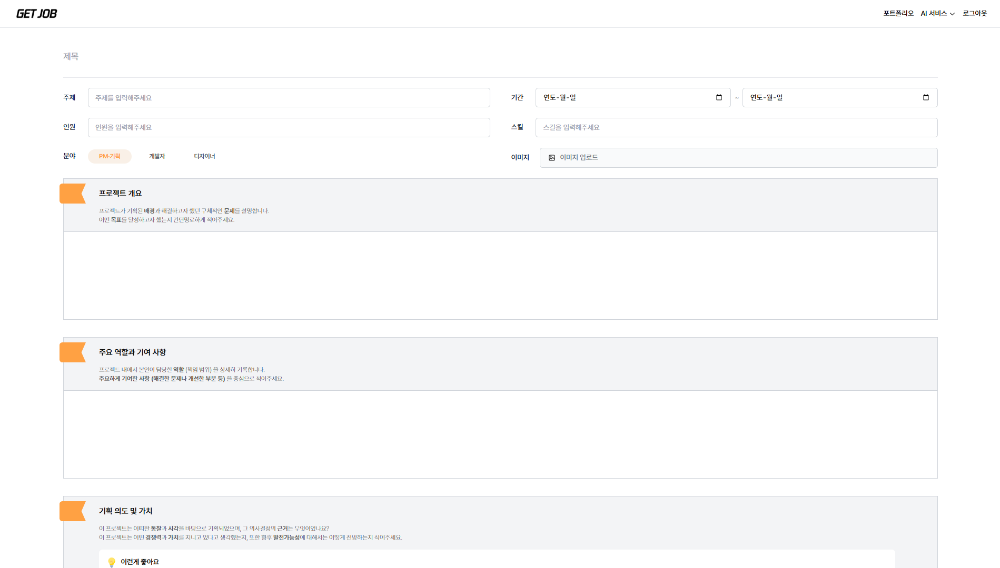
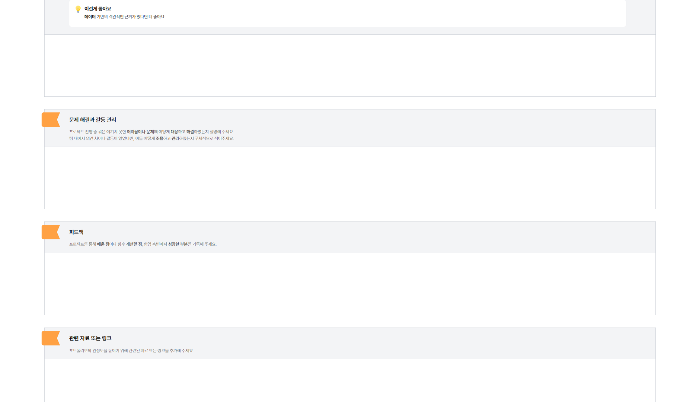
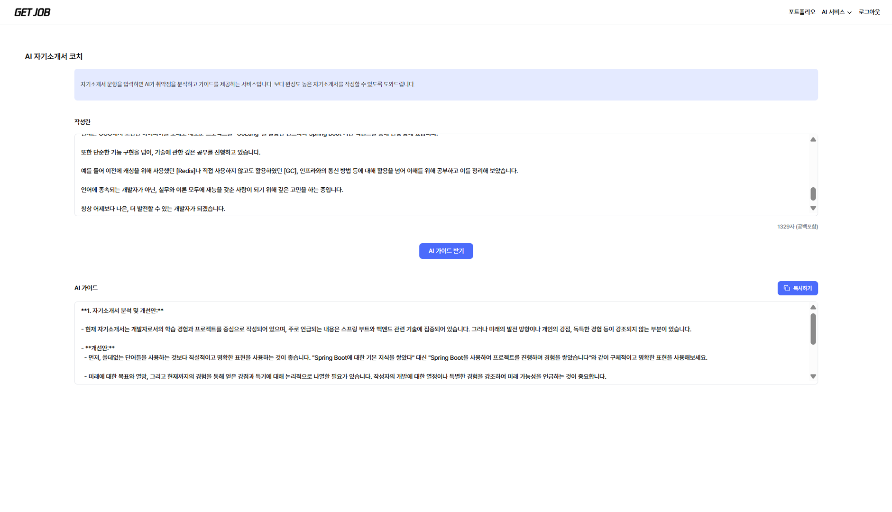
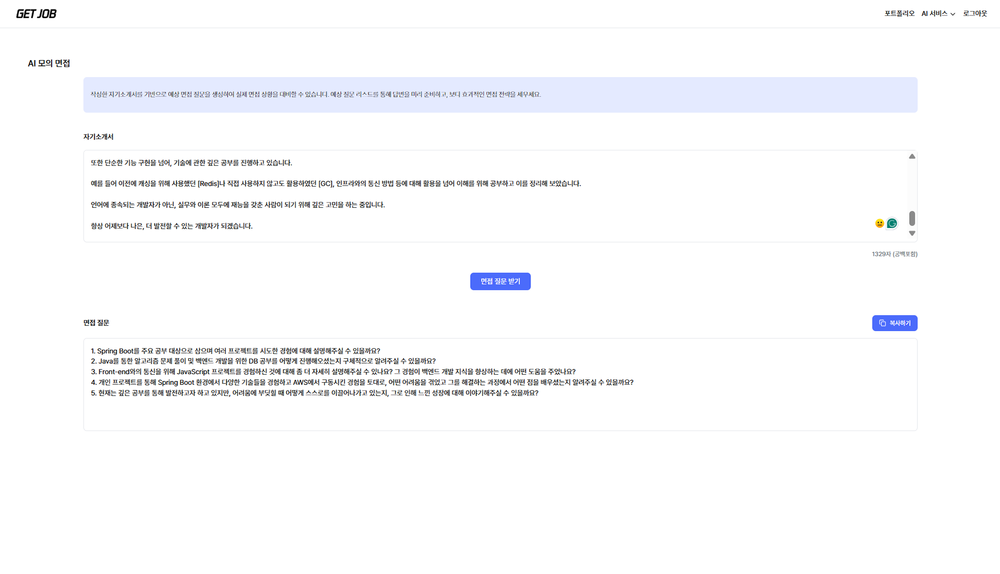

  <a href="https://getjob.world" target="_blank" title="사이트로 이동">🌐GetJob 서비스 바로가기</a>

  

    
  

<!-- Using HTML to center the abstract -->

  

    <h2>작품소개</h2>
    

    

      GETJOB은 포트폴리오, 자기소개서, 면접까지 챙겨야 할 것들이 많아 막막한 취업준비생들의 고민을 덜어주기 위해 만들어진 웹서비스입니다. 포트폴리오 작성 · 관리부터, AI 기반의 자소서 가이드와 면접 준비까지. GETJOB과 함께 커리어를 완성해보세요!
    

    <h2>기획의도</h2>
    

    

      IT 직군 구직자들이 취업 준비 과정에서 겪는 포트폴리오 작성과 자기소개서 작성의 어려움을 해소하고, 개인의 강점을 보다 전문적으로 표현할 수 있도록 돕기 위해 이 플랫폼을 기획·제작했습니다. 특히 AI 기술을 활용하여 자기소개서 교정과 맞춤형 면접 질문 생성을 지원함으로써, 준비 과정을 더욱 체계적이고 효율적으로 개선하고자 했습니다.
    

  

 

  

  
<h2>메인페이지</h2>
    

    

      GetJob 메인 페이지는 사용자에게 포트폴리오 작성, 자기소개서 교정, 면접 질문 생성 등 다양한 취업 지원 서비스를 한눈에 안내합니다. 심플하고 직관적인 구성으로 누구나 쉽게 서비스를 시작할 수 있도록 기획하였습니다.
    

    

 

  

  
<h2>포트폴리오 기록보는 페이지</h2>
    

    

      작성된 포트폴리오를 한눈에 확인할 수 있는 페이지입니다. 사용자는 자신이 등록한 포트폴리오의 상세 내용을 편리하게 조회할 수 있습니다. 또한, 필요에 따라 포트폴리오 기록을 수정하거나 삭제할 수도 있어 포트폴리오 관리가 더욱 효율적으로 이루어집니다.
    

    

 

  

  
<h2>포트폴리오 기록 페이지 (개발자)</h2>
    

    

      포트폴리오 기록 페이지(개발자)는 숭실대학교 취업센터 컨설턴트와의 상담을 기반으로, 직접 연구하고 고민하여 설계한 맞춤형 질문들을 중심으로 구성되었습니다. 단순한 경험의 나열을 넘어, 사용자의 성장 과정을 효과적으로 드러낼 수 있도록 체계적이고 심도 있게 기획한 점이 특징입니다.

이를 통해 사용자는 자신의 경험을 더욱 입체적으로 조망하고, 스스로의 성장 스토리를 명확하게 정리하는 데 도움을 받을 수 있습니다.
    

    
  

 

  

<h2>포트폴리오 기록 페이지 (디자이너)</h2>
    

    

      포트폴리오 기록 페이지(디자이너)는 숭실대학교 취업센터 컨설턴트와의 상담을 기반으로, 직접 연구하고 고민하여 설계한 맞춤형 질문들을 중심으로 구성되었습니다. 단순한 경험의 나열을 넘어, 사용자의 성장 과정을 효과적으로 드러낼 수 있도록 체계적이고 심도 있게 기획한 점이 특징입니다.

이를 통해 사용자는 자신의 경험을 더욱 입체적으로 조망하고, 스스로의 성장 스토리를 명확하게 정리하는 데 도움을 받을 수 있습니다.
    

      
  

 

  

  
<h2>포트폴리오 기록 페이지 (기획자)</h2>
    

    

      포트폴리오 기록 페이지(기획자)는 숭실대학교 취업센터 컨설턴트와의 상담을 기반으로, 직접 연구하고 고민하여 설계한 맞춤형 질문들을 중심으로 구성되었습니다. 단순한 경험의 나열을 넘어, 사용자의 성장 과정을 효과적으로 드러낼 수 있도록 체계적이고 심도 있게 기획한 점이 특징입니다.

이를 통해 사용자는 자신의 경험을 더욱 입체적으로 조망하고, 스스로의 성장 스토리를 명확하게 정리하는 데 도움을 받을 수 있습니다.
    

    
  

 

  
 
<h2>AI 자기소개서 교정 기능</h2>
    

    

사용자가 입력한 자기소개서를 AI가 정교하게 분석해 자연스럽고 세련된 문장으로 다듬어줍니다. 단순한 문법 수정에 그치지 않고, 어색한 표현과 흐름까지 개선하여, 보다 완성도 높은 자기소개서를 완성할 수 있도록 지원합니다. 글을 매끄럽게 다듬고 싶은 모든 사용자에게 빠르고 신뢰할 수 있는 교정 경험을 제공합니다.
    

    

 

  

<h2>AI 면접 질문 생성 기능</h2>
    

    

 사용자의 자기소개서나 포트폴리오 내용을 AI가 분석하여, 지원 분야와 강점을 반영한 예상 면접 질문을 자동으로 생성합니다. 단순한 질문 목록이 아닌, 개인별 특성과 경험을 바탕으로 실제 면접에 가까운 질문을 제공하여, 보다 체계적이고 실전감 있는 면접 준비를 지원합니다.
    

      

<!-- 이미지 확대용 모달 -->

  

  

    

      
    

  

  <button class="modal-close is-large" aria-label="close"></button>

<!-- jQuery 라이브러리 추가 -->

<!-- 이미지 클릭 시 모달 표시 -->

